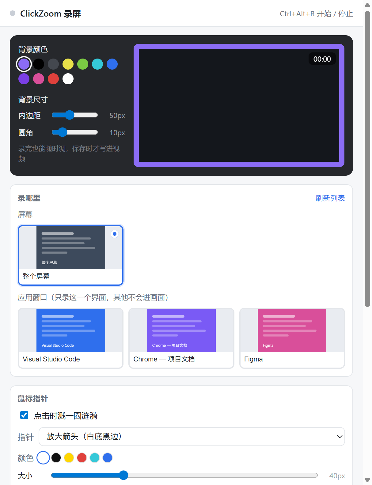

# ClickZoom 录屏

**点一下鼠标，镜头自动推近。免费、开源、无水印。**

做教程视频最烦的是什么？观众看不清你点了哪里。

这个工具就解决这一件事：**你点到哪，镜头就自动推到哪** —— 停留一下，再拉回来。
不用手动打关键帧，也不用后期剪辑。

> Screen Studio 那种"点击自动放大"的效果，Mac 上得花钱买，Windows 上一直没趁手的。
> 现在有了，而且免费。



---

## 为什么值得用

### 💰 免费

- **完全免费、开源**（MIT 协议）—— **没有时长限制、没有水印、不限制导出次数**
- **不用注册、不用登录**，装完直接用
- **不联网**：录好的视频只存在你自己电脑上，不经过任何服务器
- 同类工具基本都要订阅，而且 Screen Studio 只有 Mac 版

### 👍 好用

| 功能 | 说明 |
| --- | --- |
| 🖱️ **点哪放大哪** | 不用手动打关键帧。你点鼠标，它自动推近 → 停留 → 拉回，快慢自己调 |
| 🪟 **只录想要的界面** | 带缩略图的可视化列表，选哪个就只录哪个，其他窗口不会入镜 |
| 🎨 **录完还能调外框** | 背景色、留白、圆角随便拖，右边画面立刻跟着变，满意了再保存 |
| ✨ **鼠标指针能换** | 六种样式：放大的白箭头、手型、十字、I 型、圆点；颜色、大小都能调 |
| 👻 **录制时界面自动隐身** | 主窗口让开，只在右下角留个小条给你点"结束" —— 而且**它录不进画面** |
| ⌨️ **键盘也能控制** | `Ctrl + Alt + R` 开始 / 停止，窗口没焦点照样管用 |
| 🔍 **自带体检** | `npm run selftest` 一键自检，有问题直接告诉你哪儿不对劲 |

---

## 装一下

```bash
git clone git@github.com:Iris007-dev/clickzoom-recorder.git
cd clickzoom-recorder
npm install
npm start
```

- 需要 **Node 18+**
- **Windows 10 2004 以上**（那个"录不进画面"的悬浮控制条依赖系统支持）

`npm install` 卡在下载 Electron 的话，用国内镜像补一下：

```bash
cd node_modules/electron
ELECTRON_MIRROR=https://npmmirror.com/mirrors/electron/ node install.js
```

> **为什么用 `npm start` 而不是 `electron .`？**
> 某些环境（比如 IDE 内置终端）会注入 `ELECTRON_RUN_AS_NODE=1`，
> 让 electron.exe 退化成普通 Node，一启动就崩。
> `scripts/start.js` 会先把这个变量删掉再拉起 Electron。

---

## 怎么用

**第零步：调画面外框**（界面左上那块深色区域）

| 控件 | 作用 |
| --- | --- |
| 背景颜色 | 11 个色块，选画面外面那圈的颜色 |
| 内边距 | 画面四周留多少边，调 0 就是不留 |
| 圆角 | 画面四个角磨多圆 |

**录之前可以调，录完之后更可以随便调** —— 拖动滑块，右边的画面立刻跟着变，
确认满意了再点保存。改外框不会影响已经录好的内容，只影响最后保存出来的成品。

选完会自动记住，下次打开软件还是这套。

右边那块画面区会跟着变：

- 没在录 → 深色占位，方便你边调边看外框
- 正在录 → 显示实时画面
- 录完了 → 自动变成回放播放器（这时候照样能继续调外框）

**第一步：在「录哪里」里挑要录的界面**

这一块是**带缩略图的可视化列表**，不用认名字，看图就知道要录哪个：

- **屏幕** —— 每个显示器一张卡片
- **应用窗口** —— 当前所有能录的窗口各一张卡片，缩略图就是它此刻的样子
- 点右上角 **刷新列表** 重新扫描（中途新开了软件，点一下就会冒出来）

卡片右上角有蓝点的是当前选中的。选好之后直接开录就行，不用再划什么范围。

> **关于浏览器里的不同网页**
>
> 这里只能列出**整个浏览器窗口**，列不到里面的标签页。这不是偷懒：
> 标签页是浏览器内部的东西，只有 Chrome 自己（或它的扩展）才拿得到，
> 系统层面根本没暴露给外部程序 —— 所有第三方录屏软件都一样。
>
> 想单独录某个网页，两个办法：
> 1. 用 Chrome 菜单里的「投放/保存并分享 → 创建快捷方式」，勾上"在窗口中打开"，
>    那个网站就变成一个独立窗口，会出现在这个列表里
> 2. 或者就选那个浏览器窗口，录制时只在这个窗口里操作

**第二步：点「开始录制」**（或 `Ctrl + Alt + R`）

**第三步：录制过程中**

- 面板会自动让开，屏幕右下角留一个小条：**红点 + 计时 + 「结束」按钮**
- 点鼠标 → 镜头推近、停留、自动拉回
- 点小条上的「结束」停止，或者按 `Ctrl + Alt + R`
- 小条可以拖着换位置；它开了防捕获保护，**不会被录进画面**

**第四步：录完先回看，满意再保存**

停止后面板回到原位，画面区自动切成播放器，直接放刚才那一段（旁边标了时长和大小）：

- 满意 → 点 **保存…**，选个位置存盘
- 不满意 → 点 **丢掉**，直接重新录
- 保存框点了取消也没关系，回放还留着，想存随时再点「保存」

**回看时也可以接着调外框**（背景色 / 内边距 / 圆角）—— 拖动滑块画面立刻变，
满意再保存。这也是外框为什么是"后期"的：录制只管录画面，外框等到保存那一刻才写进去。

> 小提示：因为外框是保存时才加上去的，点保存后要**重新生成一遍**，
> 大概等视频本身那么长（5 秒的视频等 5 秒左右，状态栏有进度）。
> 如果内边距和圆角都是 0，就跳过这一步直接存，不用等。

**注意**：外框（背景色／内边距／圆角）是录制时就直接烧进画面的，
所以回看阶段再调这些参数**不会**改变已经录好的那一段 —— 改完重新录一段就行。

托盘图标（右下角）Ctrl+Alt+R 没用了时的备用入口：鼠标悬停看计时，点一下把面板叫回来，右键能直接停止或退出。

两个全局热键（窗口没焦点也能用）：

- `Ctrl + Alt + R` 开始 / 停止录制
- `Ctrl + Alt + Z` 以当前光标位置为中心推近（鼠标监视器万一罢工时用它）

## 出问题？先跑自检

```bash
npm run selftest
```

它会无人值守地录 3 秒，中途模拟两次点击放大，然后自动退出，并在终端打印一行诊断：

```
CZR-SELFTEST {"ok":true,"videoW":2880,"videoH":1800,"canvasW":1920,"canvasH":1200,
              "nonBlackRatio":0.929,"maxScale":2,"blobBytes":2146080,...}
```

怎么看这行字：

| 字段 | 含义 | 正常值 |
| --- | --- | --- |
| `mode` | 这次验的是哪种模式 | `window` 或 `screen` |
| `windowsCount` | 枚举到几个可选的窗口 | > 0 说明窗口模式可用 |
| `videoW/H` | 抓到的画面分辨率（窗口模式下是窗口大小） | 和来源一致 |
| `canvasW/H` | 实际录进视频的尺寸 | 宽度 ≤1920 |
| `nonBlackRatio` | 画面里非黑像素的占比 | **> 0.05**，0 说明录出来是黑屏 |
| `maxScale` | 过程中镜头达到的最大倍数 | **接近你设的倍数**（默认 2） |
| `blobBytes` | 视频文件大小 | 几 MB；0 说明没录到东西 |
| `framesDrawn` | 期间实际画了多少帧 | **几十帧以上**；接近 0 说明被浏览器节流了 |
| `reviewReady` / `reviewW` | 录完的回放能不能正常播放 | `true` / 画面宽度 > 0；false 说明文件读不出来 |

`ok:true` 就说明整条链路（抓屏 → 缩放 → 编码 → 落盘）是通的。
自测产物会存到系统临时目录，同时抓一张放大瞬间的快照方便肉眼看。

## 镜头参数怎么调

| 参数 | 作用 | 手感建议 |
| --- | --- | --- |
| 放大倍数 | 推近到几倍 | 2.0x 最自然；超过 2.5x 画面会糊 |
| 推近用时 | 从 1x 到目标倍数的时长 | 260ms 左右，太快像抽搐 |
| 停留时长 | 停在放大状态多久 | 700ms，够看清一个点击 |
| 拉回用时 | 回到全屏的时长 | 320ms，比推近稍慢，收尾更从容 |

核心在 `src/renderer/zoom.js`，用的 `easeInOutCubic` 缓动 —— 两头慢中间快，这是"电影感"的来源。改成线性插值会立刻变得很廉价，你可以试试。

## 鼠标指针

默认用的是**软件自己画的放大箭头**：白色填充 + 黑色细边 + 一层很轻的投影 ——
就是你熟悉的那个光标形状，只是更大更清楚，录出来观众一眼就能找到你的鼠标。

想换别的也行：

| 指针 | 说明 |
| --- | --- |
| **放大箭头** | 默认。经典光标形状的放大版，白底黑细边 |
| **手指** | 手型，像点在按钮上 |
| **十字准星** | 细十字线，讲精确位置时用 |
| **文本 I 型** | I 字形，讲输入框、选文字 |
| **圆点** | 一个圆点，完全不挡内容 |
| **系统鼠标（原样）** | 直接录你系统里那个光标，不做任何加工 |
| **不画鼠标** | 什么都不显示 |

- **颜色**默认白色 —— 最接近真实光标的观感；换成黑 / 黄 / 红 / 青 / 蓝就是个性化风格。
  描边色会自动配（浅色指针配黑边、深色配白边），所以在什么背景上都看得清。
- **大小** 16～96px，指的是指针高度，默认 36。
- 选「系统鼠标」或「不画鼠标」时，颜色和大小会自动灰掉（那时它们没意义）。

### 一个容易踩的坑

屏幕捕获**默认会把系统光标一起录进去**。所以如果一边录着真光标、一边再自己画一个，
画面上就会出现**两个鼠标**。

软件的做法是：要自绘指针时，先通过捕获参数把系统光标关掉，再画自己的 —— 所以不会重影。
（这个"关掉光标"的开关是实测确认有效的，不是猜的。）

「点击时溅一圈涟漪」是独立开关，**系统鼠标和自绘指针都能用** ——
它只是叠在光标上的一层效果，不影响用哪个指针。

### 整屏模式下那个"双鼠标"问题

必须说清楚一件事：**整屏录制时，系统光标一定会被录进画面，而且关不掉**。
捕获接口里那些"不要光标"的参数，在 Electron 里实测**都不生效**（两条路都试过）。

所以软件的做法是：**在画我们的指针之前，先把系统光标擦掉** ——
从鼠标上方借一条像素拉下来，盖住那一小块（系统光标本身只有十几像素），
然后再画我们的指针。所以最终画面里就只有一个指针。

指针大小会**跟着镜头缩放**：画面放大时指针一起变大，不然底下那个系统光标就露出来了。

> 想彻底省心，用 **「窗口」模式**：窗口捕获天然不含鼠标光标，
> 从源头上就不存在这个问题，效果也最干净。

## 原理：数据是怎么流的

```
屏幕流 (desktopCapturer)
      ↓
  <video> 播放
      ↓
  逐帧 drawImage 到 canvas   ←── 镜头裁剪/缩放、鼠标指针都画在这里
      ↓
  canvas.captureStream()
      ↓
  MediaRecorder  →  webm 文件
```

鼠标点击怎么知道的？主进程开了个 PowerShell 子进程，轮询 Windows 的
`GetAsyncKeyState` + `Cursor.Position`，把点击坐标用文本吐回来
（见 `src/main/mouse-monitor.ps1`）。

**为什么不用 uiohook 这类原生模块？** 它们要 node-gyp 编译，Node 版本一变就得重编，
在这台机器上十有八九装不上。PowerShell 方案零依赖，代价是几毫秒延迟，肉眼无感。

为了让监视器秒开，`src/main/czr-native.dll` 是**预编译好的**小助手程序集
（封装了 `GetAsyncKeyState` 和 `GetWindowRect`）。脚本优先加载它，加载不到才现场编译 C# ——
现场编译首次要十几秒，体验很差。别删这个 dll。

### 为什么"结束"按钮不会出现在录像里？

小控制条所在的那个窗口调了 Electron 的 `setContentProtection(true)`，
在 Windows 上对应系统 API `SetWindowDisplayAffinity(WDA_EXCLUDEFROMCAPTURE)` ——
由系统层面把它从屏幕捕获结果里摘掉。所以它能大大方方摆在右下角，录出来却找不到。

同理，录制开始后主面板是被**挪到屏幕外**而不是最小化：最小化会让 Chromium 判定窗口不可见，
`requestAnimationFrame` 直接停摆，录出来就是一潭死水。挪出屏幕既看不见、渲染又照跑
（自检里的 `framesDrawn` 就是用来盯这件事的）。

窗口模式怎么知道鼠标点在哪？Electron 的窗口源 id 形如 `window:<hwnd>:0`，
拿这个 hwnd 去问系统要窗口矩形（见 `src/main/window-rect.ps1`），
再把鼠标的屏幕坐标减掉窗口左上角，换算成窗口画面里的坐标。

## 已知限制 & 排错

- **整屏模式下指针位置不对**：依赖 PowerShell 监视器。它输出的是**物理像素**坐标，和 desktopCapturer
  的画面像素一一对应；高 DPI 屏如果位置偏了，调 `recorder.js` 里的 `ratioX / ratioY`。
- **系统声音录不到**：Windows 上不是所有设备都支持系统音频回环。勾上没声音的话，
  状态栏会提示，用麦克风替代即可。
- **输出是 webm**：剪映/PR 对 webm 支持一般。转 mp4：
  ```bash
  ffmpeg -i input.webm -c:v libx264 -crf 20 -c:a aac output.mp4
  ```
- **窗口模式下镜头落点偏了**：窗口在录制期间被移动过。软件只在开始录制那一刻
  读一次窗口位置，录制中请别挪窗口。
- **控制条被录进了画面**：说明系统没支持防捕获（需要 Windows 10 2004 以上；
  部分远程桌面/虚拟机环境下会失效）。此时用 `Ctrl + Alt + R` 停止，
  或者把控制条拖到屏幕外。
- **关闭软件**：直接关窗口即可，鼠标监视子进程会一起退出。
- **启动时冒出 `环境块不能多于 65535 字节`**：Windows 单个进程的环境块上限是 65535 字节，
  而 PowerShell 编译 C# 要拉起 csc.exe 子进程并继承环境块。某些环境（比如装了安全软件、
  PATH 被塞得极长）会超限。scripts 里已经做了两道防护：Node 侧只传必要变量，
  ps1 里再把超长变量清掉。启动时看到 `TRIMMED x PATH,...` 就说明防护生效了，属正常。

## 文件地图

```
clickzoom-recorder/
├── src/
│   ├── main/                  主进程
│   │   ├── main.js                窗口、IPC、托盘、热键、保存文件
│   │   ├── mouse-monitor.js       PowerShell 鼠标监视器的 Node 封装
│   │   ├── mouse-monitor.ps1      轮询系统 API，输出点击/移动（保持纯 ASCII）
│   │   ├── window-rect.ps1        查窗口在屏幕上的位置（窗口录制要用）
│   │   └── czr-native.dll         预编译的 Win32 助手，别删
│   ├── preload/preload.js     安全桥梁，把主进程能力挂到 window.api
│   └── renderer/              界面
│       ├── index.html             控制面板
│       ├── app.js                 界面逻辑
│       ├── zoom.js                缩放状态机 ★效果核心
│       ├── recorder.js            渲染循环与录制 ★效果核心
│       ├── control.html           录制时右下角的悬浮小条
│       └── region.html            区域框选窗口（入口已移除，留着备用）
├── scripts/start.js           启动引导（清掉 ELECTRON_RUN_AS_NODE 再拉起 Electron）
├── docs/                      README 用的截图
└── LICENSE                    MIT
```
